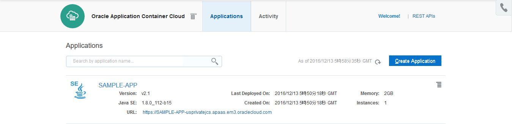
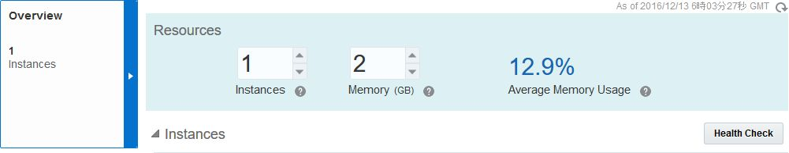
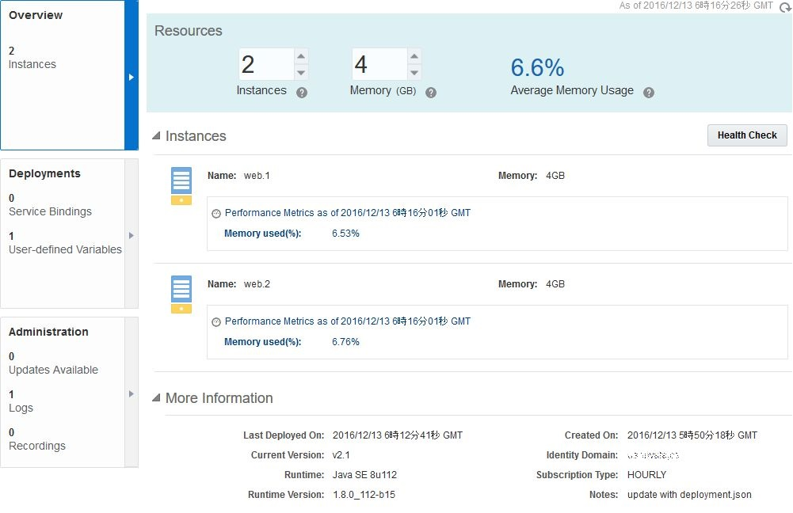
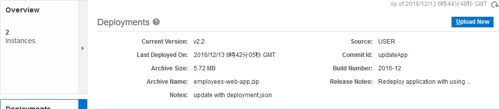

# Oracle Application Container Cloud Service - 基本操作
---
## 説明

Application Container Cloud Service は、Java アプリケーション、Node.js アプリケーション、PHP アプリケーションをデプロイし、稼働する軽量かつスケーラブルな実行環境を提供するクラウド・サービスです。
デプロイするアプリケーションは構成情報とともにアーカイブ・ファイル (.zip, .tgz)として作成します。デプロイを行う際には、GUI または、REST API を使用します。

## アプリケーション・デプロイ実施前提

- RESTクライアント: ここでは **cURL** を使用したコマンドライン操作を行います。
- アプリケーション: 構成情報 (**manifest.json**) を含むアーカイブ形式にします。
  - ***bin/get-samle-app.sh*** を使用してサンプル・アプリケーションが取得できます。


## 実施手順

### 1. Application Container Cloud Service サービス・インスタンスの作成

ダッシュボード画面からアプリケーション・コンテナ・パネルのメニューをクリックして**サービス・コンソールを開く** を選択します。


**Create Application** をクリックします。


次の中からアプリケーション・タイプを選択します。
- Java SE
- Node
- PHP

ここでは、Java によるサンプル・アプリケーションを使用するため ***Java SE*** を選択します。


アプリケーション及びインスタンスに関する情報を入力します。
- Name: アプリケーションの名前
- Subscription: 課金タイプ
- Application Archive: デプロイ対象のアプリケーションの指定
  - Deploy a Sample Application: デフォルトのサンプルを指定
  - Get Archive from Storage Path: Storage Cloud に配置したアーカイブ・ファイルを指定
  - Upload Archive: クライアント端末から指定したアーカイブ・ファイルをアップロード
- Instances: インスタンス数
- Memory: 割当てメモリ容量

それぞれ指定したら、**Create** をクリックします。


インスタンスの作成が開始したら、次のダイアログが表示されるので、**OK** をクリックします。


作成の間、しばらく待機します。


作成完了すると、次のように稼働状況を表示したインスタンス画面 (概要表示画面) が表示されます。


### 2. 各画面の確認

#### 概要 (Overview)

この画面では次の情報が確認できます。

- 稼働しているインスタンス数
- メモリ容量
- メモリ使用率
- メタデータ
  - インスタンス開始時間
  - Java バージョン
  - デプロイ日付

#### デプロイメント (Deployments)

この画面では、デプロイしているアプリケーションに関する情報を表示します。
- Deployments: アプリケーション・アーカイブに関するメタデータ
  - ファイル・サイズ
  - ファイル名
  - ビルド番号
  - など
- Launch Command: アプリケーションの実行コマンド
  - この画面から編集する事も可能
- Service Bindings: 他のクラウド・サービスとの接続情報
- Environment Variables: 環境変数
  - **Show All Valiables** にチェックをいれると設定済みの環境変数も含めて全て表示


#### 管理 (Administration)

アップデートやログ表示など、インスタンスの管理を行います。

##### Updates

新しい JDK がリリースされた場合、ここでアップデートが行えます。また、アップデート後にロールバックも可能です。


##### Logs

インスタンスが生成したログファイルを取得します。また、取得したログの履歴も表示されます。

ログを取得する場合は、**Get Log** をクリックします。


取得したログは、Storage Cloud コンテナに保管されます。ファイル名をクリックすると、Storage Cloud Service の認証情報を求められるので入力すると、ファイルをダウンロードできます。


##### Recordings

稼働しているアプリケーションに対して、1分間の **Java Flight Recorder** による情報記録を行います。

Java Flight  Recorder に関しての詳細な情報は、以下を参照して下さい。
- [参考: Java Platform, Standard Edition Java Flight Recorder ランタイムガイド](http://docs.oracle.com/javase/jp/7/technotes/guides/jfr/toc.html)
- [参考: Java Flight Recorderの紹介](http://www.slideshare.net/ChihiroIto1/javadaytokyo2015-chihiroito-45javaflightrecorder)

記録を開始する場合は、**Get Recording** をクリックします。
記録した JFR ファイルは、ファイル名をクリックするとダウンロードできます。


ダウンロードして、Java Mission Controll で情報分析を行う事が可能です。


### 3. アプリケーションの表示

Application Container Cloud Service のサービス・コンソールを開きます。作成したインスタンス一覧が表示されており、インスタンス情報の一項目に、アクセス URL が表示されています。
その URL をクリックすると、デプロイしたアプリケーションにアクセスできます。


また、インスタンスのメニューから **Open Application** を選択する事でアクセスする事も可能です。


### 4. アプリケーションの制御

#### ライフサイクル管理

インスタンスのメニューは、アプリケーションへのアクセス以外にも以下の機能を提供しています。

- Start: インスタンスの開始
- Stop: インスタンスの停止
- Restart: インスタンスの再起動
- Delete: インスタンスの削除

また、Restart を選択すると、インスタンスの再起動方法が選択できます。
- Rolling: インスタンス毎の再起動によりサービス無停止
- Concurrent: 一斉に再起動を行うため、サービス停止を伴う


#### スケーリング

サービス・インスタンス画面の Resources で、**インスタンス数**、及び **メモリ容量** をそれぞれスケーリングできます。
それぞれの値を変更し、**Apply** をクリックします。


スケーリングが完了すると、インスタンスが設定通り2つに増えている事が確認できます。また、メモリも倍増させたので使用率が半減しています。


#### アプリケーション再デプロイメント

デプロイメント画面から、アプリケーションの再デプロイを実施できます。
**Upload New** をクリックします。


**Upload Archive** を選択します。


選択するアプリケーションは、既にデプロイしているアプリケーションを使用します。再デプロイが反映された事を確認するため、バージョン情報のみをアップデートしたアーカイブを使用します。

***employees-web-app.zip*** を展開し、**manifest.json** を開きます。

```json
{
    "runtime": {
        "majorVersion": "8"
    },
    "command": "java -jar employees-app-1.0-SNAPSHOT-jar-with-dependencies.jar",
    "release": {
        "build": "2015-09",
        "commit": "commitString",
        "version": "v2.0"
    },
    "notes": "Oracle Sample Application - Web application Bootstrap"
}
```

次のように変更します:

- build: **2016-12**
- commit: **updateApp**
- version: **v2.1**

変更したら、再度 zip アーカイブします。このアーカイブファイルをデプロイ時に選択します。

アップロードが終了すると、バージョン情報が変更になっている事が確認できます。インスタンスに反映するために、再起動を行います。**Apply Edit** をクリックします。


デプロイが終了するまで、待機します。


デプロイが終了し、新しいバージョンのアプリケーションがデプロイされている事が確認できます。


### 5. REST API を用いたアプリケーション・デプロイ

REST API を用いてアプリケーションをデプロイする場合は、まず Storage Cloud Service にアプリケーション・アーカイブ・ファイルをアップロードします。そして、アップロードしたファイルを指定して Application Container Cloud Service にデプロイを行います。

#### 5.1. Storage Cloud Service へのアプリケーション・アップロード

Storage Cloud Service 上に、アプリケーション・アーカイブ・ファイルを配置するコンテナを作成します。

```bash
$ curl -i -X PUT -u <CLOUD_USER>:<CLOUD_PWD> https://<IDDOMAIN>.storage.oraclecloud.com/v1/Storage-<IDDOMAIN>/<CONTAINER_NAME>
```

- CLOUD_USER: Storage Cloud Service の権限を持つアカウント名
- CLOUD_PWD: 上記アカウントのパスワード
- IDDOMAIN: 使用しているアイデンティティ・ドメイン名
- CONTAINER_NAME: 作成するコンテナ名 (例: employees-web-app)

次に作成したコンテナにアプリケーション・アーカイブ・ファイルをアップロードします。

```bash
$ curl -i -X PUT -u <CLOUD_USER>:<CLOUD_PWD> https://<IDDOMAIN>.storage.oraclecloud.com/v1/Storage-<IDDOMAIN>/<CONTAINER_NAME>/<APPLICATION_FILE> -T <PATH_TO_FILE>/<APPLICATION_FILE>
```

- PATH_TO_FILE: ローカルのパス
- APPLICATION_FILE: アップロードするアプリケーション・アーカイブ・ファイル名 (例: employees-web-app.zip)

#### 5.2. Application Container Cloud Service へのアプリケーション・デプロイ

```bash
$ curl -i -X POST -u <CLOUD_USER>:<CLOUD_PWD> \
-H 'Content-Type: multipart/form-data' \
-H 'Accept: application/json' \
-H 'X-ID-TENANT-NAME: <IDDOMAIN>' \
-F 'name=<APPLICATION_NAME>' \
-F 'runtime=java' \
-F 'subscription=hourly' \
-F 'archiveURL=<CONTAINER_NAME>/<APPLICATION_FILE>' \
-F 'deployment=@deployment.json' \
https://psm.europe.oraclecloud.com/paas/service/apaas/api/v1.1/apps/<IDDOMAIN>
```

- deployment.json: インスタンス数やメモリ容量などの環境構成情報を記述したJSONファイル
  - 以下、サンプルのdeployment.json

```json
{
    "memory": "2G",
    "instances": "1",  
    "environment": {
        "NO_OF_CONNECTIONS":"25",
        "TWITTER_ID":"JAVA"
    },
    "services": [{
        "identifier": "ProdService",
        "type": "JAAS",
        "name": "Jaas Service",
        "username": "username",
        "password": "password"
    },
    {
        "identifier": "DBService",
        "type": "DBAAS",
        "name": "MyDB",
        "username": "username",
        "password": "password"
    }]
}
```

- memory: メモリ容量 (1GB から 20GB)
- instances: インスタンス数
- environment: 環境変数 (KEYとVALUEの組み合わせで設定)
- services: バインドする他の Oracle Cloud Service
  - identifier: 識別子
  - type: サービス・タイプ
    - JCSの場合: JAAS
    - DBCSの場合: DBAAS
    - MySQLCSの場合: MYSQLCS
  - name: サービス・インスタンス名
  - username: 該当のサービスにアクセスするユーザ名
  - password: 上記ユーザのパスワード

ここでは、次の deployment.json を使用します。

```json
{
    "memory": "2G",
    "instances": "1",
    "environment":{
        "TEST_ENV_VAR": "TestValue"
    }
}
```

以下、実行例です:

```bash
$ curl -i -X POST -u <CLOUD_USER>:<CLOUD_PWD> \
> -H 'Content-Type: multipart/form-data' \
> -H 'Accept: application/json' \
> -H 'X-ID-TENANT-NAME: IDDOMAIN' \
> -F 'name=SAMPLE-APP' \
> -F 'runtime=java' \
> -F 'subscription=hourly' \
> -F 'archiveURL=employees-web-app/employees-web-app.zip' \
> -F 'deployment=@deployment.json' \
> https://psm.europe.oraclecloud.com/paas/service/apaas/api/v1.1/apps/IDDOMAIN
HTTP/1.1 100 Continue

HTTP/1.1 202 Accepted
Server: Oracle-Application-Server-11g
Location: https://psm.europe.oraclecloud.com/paas/service/apaas/api/v1.1/apps/IDDOMAIN/SAMPLE-APP/opStatus/3226058
X-ORACLE-DMS-ECID: 005GsFBLgGa3z015Rvl3id0003KE0002ro
X-ORACLE-DMS-ECID: 005GsFBLgGa3z015Rvl3id0003KE0002ro
X-Frame-Options: DENY
Service-URI: https://psm.europe.oraclecloud.com/paas/service/apaas/api/v1.1/apps/IDDOMAIN/SAMPLE-APP
Retry-After: 5
Content-Language: en
Content-Type: application/json
Vary: user-agent
Date: Tue, 13 Dec 2016 05:50:18 GMT
Connection: close
```
```json
{
  "identityDomain": "IDDOMAIN",
  "appId": "e33c04e9-b65a-4d4f-957e-cf8d4d2328b8",
  "name": "SAMPLE-APP",
  "status": "NEW",
  "createdBy": "shinyay",
  "creationTime": "2016-12-13T05:50:18.105+0000",
  "lastModifiedTime": "2016-12-13T05:50:18.072+0000",
  "subscriptionType": "HOURLY",
  "isClustered": false,
  "requiresAntiAffinity": false,
  "computeSite": "EM003_Z18",
  "instances": [],
  "lastestDeployment": {
    "deploymentId": "230d8ca8-2b51-46e8-ab1f-842a880bdccb",
    "deploymentStatus": "READY",
    "deploymentURL": "https://psm.europe.oraclecloud.com/paas/service/apaas/api/v1.1/apps/IDDOMAIN/SAMPLE-APP/deployments/230d8ca8-2b51-46e8-ab1f-842a880bdccb"
  },
  "currentOngoingActivity": "Creating Application",
  "appURL": "https://psm.europe.oraclecloud.com/paas/service/apaas/api/v1.1/apps/IDDOMAIN/SAMPLE-APP",
  "message": []
}
```

Application Container Cloud Service のサービス・コンソールを確認すると、以下のようにインスタンスが作成されています。




#### 5.3. deployment.json を用いた構成変更

今の状態は、以下のように ***インスタンス数: 1***、***メモリ容量: 2GB*** になっています。この構成を **deployment.json** を変更し、REST API で反映させます。




以下のように、*memory* と *instance* の値を倍増させます。

```json
{
    "memory": "4G",
    "instances": "2",
    "environment":{
        "TEST_ENV_VAR": "TestValue"
    }
}
```

変更した deployment.json を指定し、以下のように実行します:

```bash
$ curl -i -X PUT -u shinyay:yanaYANA0928 \
> -H 'Content-Type: multipart/form-data' \
> -H 'Accept: application/json' \
> -H 'X-ID-TENANT-NAME: IDDOMAIN' \
> -F 'deployment=@deployment.json' \
> -F 'notes=update with deployment.json' \
https://psm.europe.oraclecloud.com/paas/service/apaas/api/v1.1/apps/IDDOMAIN/SAMPLE-APP
HTTP/1.1 100 Continue

HTTP/1.1 202 Accepted
Server: Oracle-Application-Server-11g
Location: https://psm.europe.oraclecloud.com/paas/service/apaas/api/v1.1/apps/IDDOMAIN/SAMPLE-APP/opStatus/3233760
X-ORACLE-DMS-ECID: 005GsGR^qh83z015Rvl3id0003KE0003Go
X-ORACLE-DMS-ECID: 005GsGR^qh83z015Rvl3id0003KE0003Go
X-Frame-Options: DENY
Service-URI: https://psm.europe.oraclecloud.com/paas/service/apaas/api/v1.1/apps/IDDOMAIN/SAMPLE-APP
Retry-After: 5
Content-Language: en
Content-Type: application/json
Vary: user-agent
Date: Tue, 13 Dec 2016 06:12:42 GMT
Connection: close
```
```json
{
  "identityDomain": "IDDOMAIN",
  "appId": "e33c04e9-b65a-4d4f-957e-cf8d4d2328b8",
  "name": "SAMPLE-APP",
  "status": "RUNNING",
  "createdBy": "shinyay",
  "creationTime": "2016-12-13T05:50:18.105+0000",
  "lastModifiedTime": "2016-12-13T06:12:41.819+0000",
  "subscriptionType": "HOURLY",
  "isClustered": false,
  "requiresAntiAffinity": false,
  "computeSite": "EM003_Z18",
  "instances": [
    {
      "name": "web.1",
      "status": "RUNNING",
      "memory": "2G",
      "instanceURL": "https://psm.europe.oraclecloud.com/paas/service/apaas/api/v1.1/apps/IDDOMAIN/SAMPLE-APP/instances/web.1"
    }
  ],
  "runningDeployment": {
    "deploymentId": "230d8ca8-2b51-46e8-ab1f-842a880bdccb",
    "deploymentStatus": "READY",
    "deploymentURL": "https://psm.europe.oraclecloud.com/paas/service/apaas/api/v1.1/apps/IDDOMAIN/SAMPLE-APP/deployments/230d8ca8-2b51-46e8-ab1f-842a880bdccb"
  },
  "lastestDeployment": {
    "deploymentId": "f9dab6d1-2f6a-43e4-91a5-b7b67cc2762c",
    "deploymentStatus": "READY",
    "deploymentURL": "https://psm.europe.oraclecloud.com/paas/service/apaas/api/v1.1/apps/IDDOMAIN/SAMPLE-APP/deployments/f9dab6d1-2f6a-43e4-91a5-b7b67cc2762c"
  },
  "currentOngoingActivity": "Deploying Release",
  "appURL": "https://psm.europe.oraclecloud.com/paas/service/apaas/api/v1.1/apps/IDDOMAIN/SAMPLE-APP",
  "webURL": "https://SAMPLE-APP-IDDOMAIN.apaas.em3.oraclecloud.com",
  "message": []
}
```

インスタンス詳細画面に移動すると、構成が変更されている事が確認できます。
**インスタンス数: 2**、**メモリ容量: 4GB** になっています。また、Notes も更新されてります。




#### 5.4. REST API によるアプリケーション再デプロイメント

REST API を用いて、アプリケーションの再デプロイを行います。
*employees-web-app.zip* に含まれている **manifest.json** を以下のように *version* と *notes* を変更します:

```json
{
    "runtime": {
        "majorVersion": "8"
    },
    "command": "java -jar employees-app-1.0-SNAPSHOT-jar-with-dependencies.jar",
    "release": {
        "build": "2016-12",
        "commit": "updateApp",
        "version": "v2.2"
    },
    "notes": "Redeploy application with using REST API"
}
```

5.1 で実施した手順に従って、Storage Cloud Service へアーカイブ・ファイルをアップロードします。

```
$ curl -X PUT -u <CLOUD_USER>:<CLOUD_PWD> \ https://<IDDOMAIN>.storage.oraclecloud.com/v1/Storage-<IDDOMAIN>/employees-web-app/employees-web-app.zip -T . /employees-web-app.zip
```

次に、REST API で再デプロイを行います。エンドポイントにアプリケーション名が含まれている点が初回デプロイ時と異なります:

```bash
$ curl -i -X PUT -u <CLOUD_USER>:<CLOUD_PWD> \
> -H 'Content-Type: multipart/form-data' \
> -H 'Accept: application/json' \
> -H 'X-ID-TENANT-NAME: IDDOMAIN' \
> -F 'archiveURL=employees-web-app/employees-web-app.zip' \
> -F 'deployment=@deployment.json' \
> https://psm.europe.oraclecloud.com/paas/service/apaas/api/v1.1/apps/IDDOMAIN/SAMPLE-APP
HTTP/1.1 100 Continue

HTTP/1.1 202 Accepted
Server: Oracle-Application-Server-11g
Location: https://psm.europe.oraclecloud.com/paas/service/apaas/api/v1.1/apps/IDDOMAIN/SAMPLE-APP/opStatus/3226106
X-ORACLE-DMS-ECID: 005GsI4XnU13z015Rvl3id0003KE0003TA
X-ORACLE-DMS-ECID: 005GsI4XnU13z015Rvl3id0003KE0003TA
X-Frame-Options: DENY
Service-URI: https://psm.europe.oraclecloud.com/paas/service/apaas/api/v1.1/apps/IDDOMAIN/SAMPLE-APP
Retry-After: 5
Content-Language: en
Content-Type: application/json
Vary: user-agent
Date: Tue, 13 Dec 2016 06:42:06 GMT
Connection: close
```
```json
{
  "identityDomain": "IDDOMAIN",
  "appId": "e33c04e9-b65a-4d4f-957e-cf8d4d2328b8",
  "name": "SAMPLE-APP",
  "status": "RUNNING",
  "createdBy": "shinyay",
  "creationTime": "2016-12-13T05:50:18.105+0000",
  "lastModifiedTime": "2016-12-13T06:42:05.608+0000",
  "subscriptionType": "HOURLY",
  "isClustered": false,
  "requiresAntiAffinity": false,
  "computeSite": "EM003_Z18",
  "instances": [
    {
      "name": "web.1",
      "status": "RUNNING",
      "memory": "4G",
      "instanceURL": "https://psm.europe.oraclecloud.com/paas/service/apaas/api/v1.1/apps/IDDOMAIN/SAMPLE-APP/instances/web.1"
    },
    {
      "name": "web.2",
      "status": "RUNNING",
      "memory": "4G",
      "instanceURL": "https://psm.europe.oraclecloud.com/paas/service/apaas/api/v1.1/apps/IDDOMAIN/SAMPLE-APP/instances/web.2"
    }
  ],
  "runningDeployment": {
    "deploymentId": "f9dab6d1-2f6a-43e4-91a5-b7b67cc2762c",
    "deploymentStatus": "READY",
    "deploymentURL": "https://psm.europe.oraclecloud.com/paas/service/apaas/api/v1.1/apps/IDDOMAIN/SAMPLE-APP/deployments/f9dab6d1-2f6a-43e4-91a5-b7b67cc2762c"
  },
  "lastestDeployment": {
    "deploymentId": "abc3a795-2897-4a31-9ff0-5b2cc1b0c257",
    "deploymentStatus": "READY",
    "deploymentURL": "https://psm.europe.oraclecloud.com/paas/service/apaas/api/v1.1/apps/IDDOMAIN/SAMPLE-APP/deployments/abc3a795-2897-4a31-9ff0-5b2cc1b0c257"
  },
  "currentOngoingActivity": "Deploying Release",
  "appURL": "https://psm.europe.oraclecloud.com/paas/service/apaas/api/v1.1/apps/IDDOMAIN/SAMPLE-APP",
  "webURL": "https://SAMPLE-APP-IDDOMAIN.apaas.em3.oraclecloud.com",
  "message": []
}
```

インスタンス詳細画面のデプロイメント画面を開くと、manifest.json の更新内容が反映されている事が確認でき、再デプロイメントが実施できた事が確認できます。


