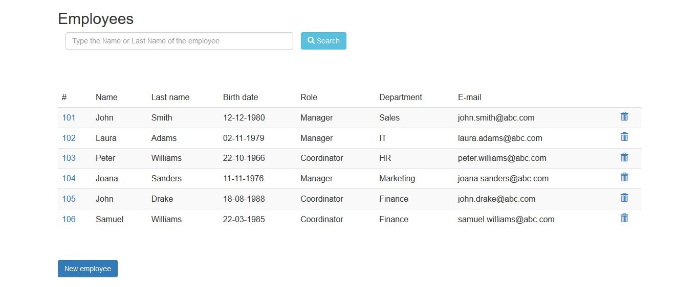
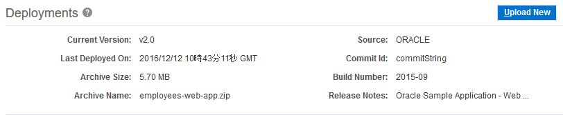
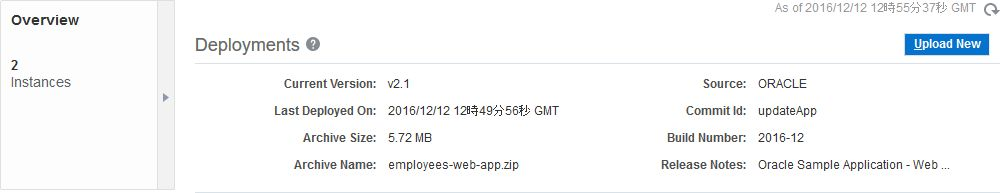

# Oracle Application Container Cloud Service - 基本操作
---
## 説明

Application Container Cloud Service は、Java アプリケーション、Node.js アプリケーション、PHP アプリケーションをデプロイし、稼働する軽量かつスケーラブルな実行環境を提供するクラウド・サービスです。
デプロイするアプリケーションは構成情報とともにアーカイブ・ファイル (.zip, .tgz)として作成します。デプロイを行う際には、GUI または、REST API を使用します。

## アプリケーション・デプロイ実施前提

- RESTクライアント: ここでは **cURL** を使用したコマンドライン操作を行います。\
- アプリケーション: 構成情報 (**manifest.json**) を含むアーカイブ形式にします。
  - ***bin/get-samle-app.sh*** を使用してサンプル・アプリケーションが取得できます。


## 実施手順

### 1. Application Container Cloud Service サービス・インスタンスの作成

ダッシュボード画面からアプリケーション・コンテナ・パネルのメニューをクリックして**サービス・コンソールを開く** を選択します。


**Create Application** をクリックします。


次の中からアプリケーション・タイプを選択します。
- Java SE
- Node
- PHP

ここでは、Java によるサンプル・アプリケーションを使用するため ***Java SE*** を選択します。


アプリケーション及びインスタンスに関する情報を入力します。
- Name: アプリケーションの名前
- Subscription: 課金タイプ
- Application Archive: デプロイ対象のアプリケーションの指定
  - Deploy a Sample Application: デフォルトのサンプルを指定
  - Get Archive from Storage Path: Storage Cloud に配置したアーカイブ・ファイルを指定
  - Upload Archive: クライアント端末から指定したアーカイブ・ファイルをアップロード
- Instances: インスタンス数
- Memory: 割当てメモリ容量

それぞれ指定したら、**Create** をクリックします。


インスタンスの作成が開始したら、次のダイアログが表示されるので、**OK** をクリックします。


作成の間、しばらく待機します。


作成完了すると、次のように稼働状況を表示したインスタンス画面 (概要表示画面) が表示されます。


### 2. 各画面の確認

#### 概要 (Overview)

この画面では次の情報が確認できます。

- 稼働しているインスタンス数
- メモリ容量
- メモリ使用率
- メタデータ
  - インスタンス開始時間
  - Java バージョン
  - デプロイ日付

#### デプロイメント (Deployments)

この画面では、デプロイしているアプリケーションに関する情報を表示します。
- Deployments: アプリケーション・アーカイブに関するメタデータ
  - ファイル・サイズ
  - ファイル名
  - ビルド番号
  - など
- Launch Command: アプリケーションの実行コマンド
  - この画面から編集する事も可能
- Service Bindings: 他のクラウド・サービスとの接続情報
- Environment Variables: 環境変数
  - **Show All Valiables** にチェックをいれると設定済みの環境変数も含めて全て表示


#### 管理 (Administration)

アップデートやログ表示など、インスタンスの管理を行います。

##### Updates

新しい JDK がリリースされた場合、ここでアップデートが行えます。また、アップデート後にロールバックも可能です。


##### Logs

インスタンスが生成したログファイルを取得します。また、取得したログの履歴も表示されます。

ログを取得する場合は、**Get Log** をクリックします。


取得したログは、Storage Cloud コンテナに保管されます。ファイル名をクリックすると、Storage Cloud Service の認証情報を求められるので入力すると、ファイルをダウンロードできます。


##### Recordings

稼働しているアプリケーションに対して、1分間の **Java Flight Recorder** による情報記録を行います。

Java Flight  Recorder に関しての詳細な情報は、以下を参照して下さい。
- [参考: Java Platform, Standard Edition Java Flight Recorder ランタイムガイド](http://docs.oracle.com/javase/jp/7/technotes/guides/jfr/toc.html)
- [参考: Java Flight Recorderの紹介](http://www.slideshare.net/ChihiroIto1/javadaytokyo2015-chihiroito-45javaflightrecorder)

記録を開始する場合は、**Get Recording** をクリックします。
記録した JFR ファイルは、ファイル名をクリックするとダウンロードできます。


ダウンロードして、Java Mission Controll で情報分析を行う事が可能です。


### 3. アプリケーションの表示

Application Container Cloud Service のサービス・コンソールを開きます。作成したインスタンス一覧が表示されており、インスタンス情報の一項目に、アクセス URL が表示されています。
その URL をクリックすると、デプロイしたアプリケーションにアクセスできます。




また、インスタンスのメニューから **Open Application** を選択する事でアクセスする事も可能です。


### 4. アプリケーションの制御

#### ライフサイクル管理

インスタンスのメニューは、アプリケーションへのアクセス以外にも以下の機能を提供しています。

- Start: インスタンスの開始
- Stop: インスタンスの停止
- Restart: インスタンスの再起動
- Delete: インスタンスの削除

また、Restart を選択すると、インスタンスの再起動方法が選択できます。
- Rolling: インスタンス毎の再起動によりサービス無停止
- Concurrent: 一斉に再起動を行うため、サービス停止を伴う


#### スケーリング

サービス・インスタンス画面の Resources で、**インスタンス数**、及び **メモリ容量** をそれぞれスケーリングできます。
それぞれの値を変更し、**Apply** をクリックします。


スケーリングが完了すると、インスタンスが設定通り2つに増えている事が確認できます。また、メモリも倍増させたので使用率が半減しています。


#### アプリケーション再デプロイメント

デプロイメント画面から、アプリケーションの再デプロイを実施できます。
**Upload New** をクリックします。




**Upload Archive** を選択します。


選択するアプリケーションは、既にデプロイしているアプリケーションを使用します。再デプロイが反映された事を確認するため、バージョン情報のみをアップデートしたアーカイブを使用します。

***employees-web-app.zip*** を展開し、**manifest.json** を開きます。

```json
{
    "runtime": {
        "majorVersion": "8"
    },
    "command": "java -jar employees-app-1.0-SNAPSHOT-jar-with-dependencies.jar",
    "release": {
        "build": "2015-09",
        "commit": "commitString",
        "version": "v2.0"
    },
    "notes": "Oracle Sample Application - Web application Bootstrap"
}
```

次のように変更します:

- build: **2016-12**
- commit: **updateApp**
- version: **v2.1**

変更したら、再度 zip アーカイブします。このアーカイブファイルをデプロイ時に選択します。

アップロードが終了すると、バージョン情報が変更になっている事が確認できます。インスタンスに反映するために、再起動を行います。**Apply Edit** をクリックします。


デプロイが終了するまで、待機します。


デプロイが終了し、新しいバージョンのアプリケーションがデプロイされている事が確認できます。


